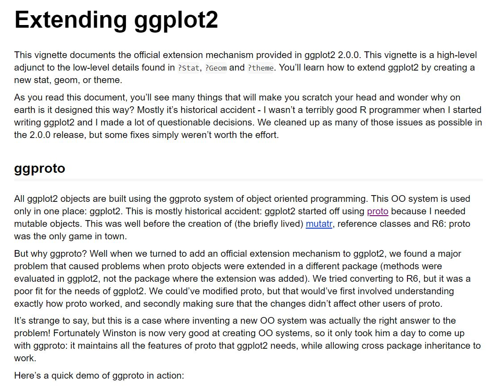

```{r setup, include=FALSE, message = FALSE}
options(htmltools.dir.version = FALSE)
library(here)
library(tidyverse)
beaches <- read_csv(here("data","sydneybeaches3.csv"))
```

class: split-two bg-main1

.column.bg-main1[.content.vmiddle.center[

# Data visualisation

<br>

.pull.left[.pad1[

### .orange[**What?**] Drawing pictures
### .orange[**Why?**] Understand your data
### .orange[**How?**] Using tidyverse (ggplot2)

]]

]]

.column.bg-main3[.content.vmiddle.center[


[@allison_horst](https://twitter.com/allison_horst)

]]


<!-- *********** NEW SLIDE ************** -->
---

class: bg-main1 center middle hide-slide-number

.reveal-text.bg-main2[.pad1[
.font4[The Sydney Beaches Data]
]]


<!-- *********** NEW SLIDE ************** -->
---

class: bg-main1 middle center

.pull.left[.pad1[.font2[
```{r beachesdata, eval=TRUE, message=FALSE}
beaches <- here("data","sydneybeaches3.csv") %>% read_csv() 
beaches
```
]]]


<!-- *********** NEW SLIDE ************** -->
---

class: bg-main1 center middle hide-slide-number

.reveal-text.bg-main2[.pad1[
.font4[Painting a Picture]
]]


<!-- *********** NEW SLIDE ************** -->
---
class: split-50 bg-main1

.column.bg-main1[.content.vtop.center[

.pull.left[.pad1[.font2[

## A grammar...

- grammars compose & reuse small parts
- complex structures from simpler units

## ...of graphics

- uses the "painters model"
- a plot is built in layers
- each layer is drawn on top of the last

]]]
]]

.column.bg-main3[.content.vmiddle.center[


[Image credit: Trinity Treft](https://unsplash.com/photos/waYWz3vAYJQ)

]]


<!-- *********** NEW SLIDE ************** -->
---
class: split-40 bg-main1

.column.bg-main1[.content.vtop.center[

.pull.left[.pad1[.font2[

A blank canvas

```{r, eval=FALSE, message = FALSE}
ggplot()
```

]]]
]]

.column.bg-main3[.content.vtop.center[
.pad1[.font2[
```{r blankcanvas, eval=TRUE, message = FALSE, echo=FALSE, cache=TRUE}
ggplot() 
```

]]
]]


<!-- *********** NEW SLIDE ************** -->
---
class: split-40 bg-main1

.column.bg-main1[.content.vtop.center[
.pull.left[.pad1[.font2[
Specify the data
```{r, eval=FALSE, message = FALSE}
ggplot(
  data = beaches #<<
)
```

]]]
]]

.column.bg-main3[.content.vtop.center[
.pad1[.font2[
```{r stillblankcanvas, eval=TRUE, message = FALSE, echo=FALSE, cache=TRUE}
ggplot(
  data = beaches #<<
) 
```

]]
]]


<!-- *********** NEW SLIDE ************** -->
---
class: split-40 bg-main1

.column.bg-main1[.content.vtop.center[

.pull.left[.pad1[.font2[
Specify the aesthetics
```{r, eval=FALSE, message = FALSE}
ggplot(
  data = beaches,
  mapping = aes(      #<<
    x = temperature, #<<
    y = rainfall       #<<
  )                   #<<
)
```

- x-axis location
- y-axis location
- colour of marker
- fill of a marker
- shape of a marker
]]]
]]

.column.bg-main3[.content.vtop.center[
.pad1[.font2[
```{r aesthetics, eval=TRUE, message = FALSE, echo=FALSE, cache=TRUE}
ggplot(
  data = beaches,
  mapping = aes(
    x = temperature, 
    y = rainfall
  ) 
)
```

]]
]]


<!-- *********** NEW SLIDE ************** -->
---
class: split-40 bg-main1

.column.bg-main1[.content.vtop.center[

.pull.left[.pad1[.font2[
Add a layer
```{r, eval=FALSE, message = FALSE}
ggplot(
  data = beaches,
  mapping = aes(
    x = temperature, 
    y = rainfall
  ) 
) + 
geom_point() #<<
```

]]]
]]

.column.bg-main3[.content.vtop.center[
.pad1[.font2[
```{r add_layer, eval=TRUE, message = FALSE, echo=FALSE, cache=TRUE, warning=FALSE}
ggplot(
  data = beaches,
  mapping = aes(
    x = temperature, 
    y = rainfall
  ) 
) + 
geom_point() #<<
```

]]
]]


<!-- *********** NEW SLIDE ************** -->
---
class: split-40 bg-main1

.column.bg-main1[.content.vtop.center[

.pull.left[.pad1[.font2[
Add layer-specific aesthetics
```{r, eval=FALSE, message = FALSE}
ggplot(
  data = beaches,
  mapping = aes(
    x = temperature, 
    y = rainfall
  ) 
) + 
geom_point(size = 3) #<<
```

]]]
]]

.column.bg-main3[.content.vtop.center[
.pad1[.font2[
```{r add_fixedaesthetic, eval=TRUE, message = FALSE, echo=FALSE, cache=TRUE, warning=FALSE}
ggplot(
  data = beaches,
  mapping = aes(
    x = temperature, 
    y = rainfall
  ) 
) + 
geom_point(size = 3) #<<
```

]]
]]


<!-- *********** NEW SLIDE ************** -->
---
class: split-40 bg-main1

.column.bg-main1[.content.vtop.center[

.pull.left[.pad1[.font2[
Add layer-specific mappings
```{r, eval=FALSE, message = FALSE}
ggplot(
  data = beaches,
  mapping = aes(
    x = temperature, 
    y = rainfall
  ) 
) + 
geom_point(
  mapping = aes(colour = season_name), #<<
  size = 3
)   
```

]]]
]]

.column.bg-main3[.content.vtop.center[
.pad1[.font2[
```{r add_layeraesthetic, eval=TRUE, message = FALSE, echo=FALSE, cache=TRUE, warning=FALSE}
ggplot(
  data = beaches,
  mapping = aes(
    x = temperature, 
    y = rainfall
  ) 
) + 
geom_point(
  mapping = aes(colour = season_name), #<<
  size = 3
) 
```

]]
]]


<!-- *********** NEW SLIDE ************** -->
---
class: split-40 bg-main1

.column.bg-main1[.content.vtop.center[

.pull.left[.pad1[.font2[
Add more layers
```{r, eval=FALSE, message = FALSE}
ggplot(
  data = beaches,
  mapping = aes(
    x = temperature, 
    y = rainfall
  ) 
) + 
geom_point(
  mapping = aes(colour = season_name),
  size = 3
) + 
geom_rug() #<<
```

]]]
]]

.column.bg-main3[.content.vtop.center[
.pad1[.font2[
```{r two_layers, eval=TRUE, message = FALSE, echo=FALSE, cache=TRUE, warning=FALSE}
ggplot(
  data = beaches,
  mapping = aes(
    x = temperature, 
    y = rainfall
  ) 
) + 
geom_point(
  mapping = aes(colour = season_name), 
  size = 3
) + 
geom_rug()
```

]]
]]


<!-- *********** NEW SLIDE ************** -->
---
class: split-40 bg-main1

.column.bg-main1[.content.vtop.center[

.pull.left[.pad1[.font2[
Split into facets
```{r, eval=FALSE, message = FALSE}
ggplot(
  data = beaches,
  mapping = aes(
    x = temperature, 
    y = rainfall
  ) 
) + 
geom_point(
  mapping = aes(colour = season_name), 
  size = 2
) + 
geom_rug() + 
facet_wrap(vars(season_name)) #<<
```

]]]
]]

.column.bg-main3[.content.vtop.center[
.pad1[.font2[
```{r add_facets, eval=TRUE, message = FALSE, echo=FALSE, cache=TRUE, warning=FALSE}
ggplot(
  data = beaches,
  mapping = aes(
    x = temperature, 
    y = rainfall
  ) 
) + 
geom_point(
  mapping = aes(colour = season_name), 
  size = 2
) + 
geom_rug() + 
facet_wrap(vars(season_name)) #<<
```

]]
]]


<!-- *********** NEW SLIDE ************** -->
---
class: split-40 bg-main1

.column.bg-main1[.content.vtop.center[

.pull.left[.pad1[.font2[
Remove an unwanted legend
```{r, eval=FALSE, message = FALSE}
ggplot(
  data = beaches,
  mapping = aes(
    x = temperature, 
    y = rainfall
  ) 
) + 
geom_point(
  mapping = aes(colour = season_name), 
  size = 2,
  show.legend = FALSE #<<
) + 
geom_rug() + 
facet_wrap(vars(season_name)) 
```

]]]
]]

.column.bg-main3[.content.vtop.center[
.pad1[.font2[
```{r remove_legend, eval=TRUE, message = FALSE, echo=FALSE, cache=TRUE, warning=FALSE}
ggplot(
  data = beaches,
  mapping = aes(
    x = temperature, 
    y = rainfall
  ) 
) + 
geom_point(
  mapping = aes(colour = season_name), 
  size = 2,
  show.legend = FALSE #<<
) + 
geom_rug() + 
facet_wrap(vars(season_name)) 
```

]]
]]


<!-- *********** NEW SLIDE ************** -->
---
class: split-40 bg-main1

.column.bg-main1[.content.vtop.center[

.pull.left[.pad1[.font2[
Modify the theme
```{r, eval=FALSE, message = FALSE}
ggplot(
  data = beaches,
  mapping = aes(
    x = temperature, 
    y = rainfall
  ) 
) + 
geom_point(
  mapping = aes(colour = season_name), 
  size = 2,
  show.legend = FALSE 
) + 
geom_rug() + 
facet_wrap(vars(season_name)) + 
theme_bw() #<<
```

]]]
]]

.column.bg-main3[.content.vtop.center[
.pad1[.font2[
```{r add_theme, eval=TRUE, message = FALSE, echo=FALSE, cache=TRUE, warning=FALSE}
ggplot(
  data = beaches,
  mapping = aes(
    x = temperature, 
    y = rainfall
  ) 
) + 
geom_point(
  mapping = aes(colour = season_name), 
  size = 2,
  show.legend = FALSE #<<
) +
geom_rug() + 
facet_wrap(vars(season_name)) + 
theme_bw() 
```

]]
]]


<!-- *********** NEW SLIDE ************** -->
---
class: split-50 bg-main1

.column.bg-main1[.content.vtop.center[

.pull.left[.pad1[.font2[
(Nothing to see here...)
```{r, eval=FALSE, message = FALSE}
ggplot(
  data = beaches,
  mapping = aes(
    x = temperature, 
    y = rainfall)) + 
geom_point(
  mapping = aes(colour = season_name), 
  size = 2,
  show.legend = FALSE) + 
geom_rug() + 
facet_wrap(vars(season_name)) + 
theme_bw()
```

]]]
]]

.column.bg-main3[.content.vtop.center[
.pad1[.font2[
```{r add_theme2, eval=TRUE, message = FALSE, echo=FALSE, cache=TRUE, warning=FALSE}
ggplot(
  data = beaches,
  mapping = aes(
    x = temperature, 
    y = rainfall
  ) 
) + 
geom_point(
  mapping = aes(colour = season_name), 
  size = 2,
  show.legend = FALSE #<<
) +
geom_rug() + 
facet_wrap(vars(season_name)) + 
theme_bw() 
```

]]
]]


<!-- *********** NEW SLIDE ************** -->
---
class: split-50 bg-main1

.column.bg-main1[.content.vtop.center[

.pull.left[.pad1[.font2[
Make nicer titles
```{r, eval=FALSE, message = FALSE}
ggplot(
  data = beaches,
  mapping = aes(
    x = temperature, 
    y = rainfall)) + 
geom_point(
  mapping = aes(colour = season_name), 
  size = 2,
  show.legend = FALSE) +  
geom_rug() + 
facet_wrap(vars(season_name)) + 
theme_bw() +
labs( #<<
  title = "Sydney weather by season", #<<
  subtitle = "Data from 2013 to 2018", #<<
  x = "Temperature (Celsius)", #<<
  y = "Rainfall (mm)" #<<
) #<<

```

]]]
]]

.column.bg-main3[.content.vtop.center[
.pad1[.font2[
```{r add_titles, eval=TRUE, message = FALSE, echo=FALSE, cache=TRUE, warning=FALSE}
ggplot(
  data = beaches,
  mapping = aes(
    x = temperature, 
    y = rainfall
  ) 
) + 
geom_point(
  mapping = aes(colour = season_name), 
  size = 2,
  show.legend = FALSE
) +
geom_rug() + 
facet_wrap(vars(season_name)) + 
theme_bw() + 
labs( #<<
  title = "Sydney weather by season", #<<
  subtitle = "Data from 2013 to 2018", #<<
  x = "Temperature (Celsius)", #<<
  y = "Rainfall (mm)" #<<
) #<<
```

]]
]]


<!-- *********** NEW SLIDE ************** -->
---
class: split-50 bg-main1

.column.bg-main1[.content.vtop.center[
.pull.left[.pad1[.font2[
Done!
```{r, eval=FALSE, message = FALSE}
ggplot(
  data = beaches,
  mapping = aes(
    x = temperature, 
    y = rainfall)) + 
geom_point(
  mapping = aes(colour = season_name), 
  size = 2,
  show.legend = FALSE) +  
geom_rug() + 
facet_wrap(vars(season_name)) + 
theme_bw() +
labs( 
  title = "Sydney weather by season", 
  subtitle = "Data from 2013 to 2018", 
  x = "Temperature (Celsius)", 
  y = "Rainfall (mm)" 
) 
```
]]]
]]

.column.bg-main3[.content.vtop.center[
.pad1[.font2[
```{r done, eval=TRUE, message = FALSE, echo=FALSE, cache=TRUE, warning=FALSE}
ggplot(
  data = beaches,
  mapping = aes(
    x = temperature, 
    y = rainfall
  ) 
) + 
geom_point(
  mapping = aes(colour = season_name), 
  size = 2,
  show.legend = FALSE
) +
geom_rug() + 
facet_wrap(vars(season_name)) + 
theme_bw() + 
labs( #<<
  title = "Sydney weather by season", #<<
  subtitle = "Data from 2013 to 2018", #<<
  x = "Temperature (Celsius)", #<<
  y = "Rainfall (mm)"
) #<<
```

]]
]]


<!-- *********** NEW SLIDE ************** -->
---
class: bg-main1

.content.vtop.center[
.pull.left[.pad1[.font2[
Ingredients of this plot/cake 
- Data
- Aesthetics
- Layers
- Facets
- Theme
- Labels
- (Coordinates)
- (Scales)
]]]
]


<!-- *********** NEW SLIDE ************** -->
---

class: center middle hide-slide-number

.pad1[
.font4[
Exercise: Test drive with ggplot2 <br>
https://djnavarro.github.io/some_url_here
]]


<!-- *********** NEW SLIDE ************** -->
---

class: bg-main1 center middle hide-slide-number

.reveal-text.bg-main2[.pad1[
.font4[Introducing ggplot objects]
]]


<!-- *********** NEW SLIDE ************** -->
---
class: split-50 bg-main1

.column.bg-main1[.content.vtop.center[

.pull.left[.pad1[.font2[
Let's create a plot with no layers!
```{r, eval=FALSE, message = FALSE}
pic <- ggplot(
  data = beaches,
  mapping = aes(x = temperature) 
) + 
facet_wrap(vars(season_name)) + 
theme_bw() +
labs( 
  title = "Sydney temperature by season", 
  subtitle = "Data from 2013 to 2018", 
  x = "Temperature (Celsius)", 
  y = "" 
) 
```

]]]
]]

.column.bg-main3[.content.vtop.center[
.pad1[.font2[
```{r baseplot_noprint, eval=TRUE, message = FALSE, echo=FALSE, cache=TRUE, warning=FALSE}
pic <- ggplot(
  data = beaches,
  mapping = aes(x = temperature) 
) + 
facet_wrap(vars(season_name)) + 
theme_bw() +
labs( 
  title = "Sydney temperature by season", 
  subtitle = "Data from 2013 to 2018", 
  x = "Temperature (Celsius)", 
  y = "" 
) 
```

]]
]]


<!-- *********** NEW SLIDE ************** -->
---
class: split-50 bg-main1

.column.bg-main1[.content.vtop.center[

.pull.left[.pad1[.font2[
Let's create a plot with no layers!
```{r, eval=FALSE, message = FALSE}
pic <- ggplot(
  data = beaches,
  mapping = aes(x = temperature) 
) + 
facet_wrap(vars(season_name)) + 
theme_bw() +
ggtitle( 
  label = "Sydney temperature by season",
  subtitle = "Data from 2013 to 2018"
) +
xlab("Temperature (Celsius)") +
ylab("") 

plot(pic) #<<
```

]]]
]]

.column.bg-main3[.content.vtop.center[
.pad1[.font2[
```{r baseplot_plotted, eval=TRUE, message = FALSE, echo=FALSE, cache=TRUE, warning=FALSE}
pic <- ggplot(
  data = beaches,
  mapping = aes(x = temperature) 
) + 
facet_wrap(vars(season_name)) + 
theme_bw() +
ggtitle( 
  label = "Sydney temperature by season",
  subtitle = "Data from 2013 to 2018"
) +
xlab("Temperature (Celsius)") +
ylab("") 

plot(pic)
```

]]
]]


<!-- *********** NEW SLIDE ************** -->
---
class: split-50 bg-main1

.column.bg-main1[.content.vtop.center[

.pull.left[.pad1[.font2[
Let's create a plot with no layers!
```{r, eval=FALSE, message = FALSE}
pic <- ggplot(
  data = beaches,
  mapping = aes(x = temperature) 
) + 
facet_wrap(vars(season_name)) + 
theme_bw() +
ggtitle( 
  label = "Sydney temperature by season",
  subtitle = "Data from 2013 to 2018"
) +
xlab("Temperature (Celsius)") +
ylab("") 

print(pic) #<<
```

]]]
]]

.column.bg-main3[.content.vtop.center[
.pad1[.font2[
```{r baseplot_printed, eval=TRUE, message = FALSE, echo=FALSE, cache=TRUE, warning=FALSE}
pic <- ggplot(
  data = beaches,
  mapping = aes(x = temperature) 
) + 
facet_wrap(vars(season_name)) + 
theme_bw() +
ggtitle( 
  label = "Sydney temperature by season",
  subtitle = "Data from 2013 to 2018"
) +
xlab("Temperature (Celsius)") +
ylab("") 

print(pic)
```

]]
]]


<!-- *********** NEW SLIDE ************** -->
---
class: bg-main1

.content.vtop.center[
.pull.left[.pad1[.font2[
What are you????
```{r class_info, eval=TRUE, message = FALSE, echo=TRUE, cache=TRUE, warning=FALSE}
class(pic)
```
]]]
]


<!-- *********** NEW SLIDE ************** -->
---
class: bg-main1

.content.vtop.center[
.pull.left[.pad4[.font1[
```{r str_info, eval=TRUE, message = FALSE, echo=TRUE, cache=TRUE, warning=FALSE}
summary(pic)
```
]]]
]


<!-- *********** NEW SLIDE ************** -->
---
class: bg-main1

.content.vtop.center[
.pull.left[.pad1[.font2[
Okaaaay .... what are the *names* of the things in you????
```{r names_info, eval=TRUE, message = FALSE, echo=TRUE, cache=TRUE, warning=FALSE}
names(pic)
```
]]]
]


<!-- *********** NEW SLIDE ************** -->
---
class: bg-main1

.content.vtop.center[
.pull.left[.pad1[.font2[
Example 1: data
```{r, eval=TRUE, message = FALSE, echo=TRUE, cache=TRUE, warning=FALSE}
pic$data
```
]]]
]


<!-- *********** NEW SLIDE ************** -->
---
class: bg-main1

.content.vtop.center[
.pull.left[.pad1[.font2[
Example 2: mapping
```{r, eval=TRUE, message = FALSE, echo=TRUE, cache=TRUE, warning=FALSE}
pic$mapping
```
]]]
]


<!-- *********** NEW SLIDE ************** -->
---
class: bg-main1

.content.vtop.center[
.pull.left[.pad1[.font2[
Quick overview: 
- data: the actual data
- layers: what to plot and how to render it
- scales: how to render x-axis, colour
- mapping: which variables map to which scales
- theme: visual styling information
- coordinates: how to lay it out? Cartesian, polar, etc?
- facet: how to break the plot into facets
- plot_env: environment in which to do computation
- labels: axis labels, titles etc.
]]]
]


<!-- *********** NEW SLIDE ************** -->
---

class: center middle hide-slide-number

.pad1[
.font4[
Exercise: Peeking inside the gg object <br>
https://djnavarro.github.io/some_url_here
]]


<!-- *********** NEW SLIDE ************** -->
---

class: bg-main1 center middle hide-slide-number

.reveal-text.bg-main2[.pad1[
.font4[Layers]
]]


<!-- *********** NEW SLIDE ************** -->
---
class: split-40 bg-main1

.column.bg-main1[.content.vtop.center[

.pull.left[.pad1[.font2[
Layers can compute things!
```{r, eval=FALSE, message = FALSE}
pic 
```


]]]
]]


.column.bg-main3[.content.vtop.center[
.pad1[.font2[
```{r no_histogram, eval=TRUE, message = FALSE, echo=FALSE, cache=TRUE, warning=FALSE}
pic
```

]]
]]


<!-- *********** NEW SLIDE ************** -->
---
class: split-40 bg-main1

.column.bg-main1[.content.vtop.center[

.pull.left[.pad1[.font2[
Layers can compute things!
```{r, eval=FALSE, message = FALSE}
pic_hist <- pic +  #<<
  geom_histogram() #<<

pic_hist
```

- histograms are not "in the data"
- this is computed by the layer...
- (...sort of)

]]]
]]


.column.bg-main3[.content.vtop.center[
.pad1[.font2[
```{r add_histogram, eval=TRUE, message = FALSE, echo=FALSE, cache=TRUE, warning=FALSE}
pic_hist <- pic + geom_histogram()
pic_hist
```

]]
]]


<!-- *********** NEW SLIDE ************** -->
---
class: split-40 bg-main1

.column.bg-main1[.content.vtop.center[

.pull.left[.pad1[.font2[
Layers can compute things!
```{r, eval=FALSE, message = FALSE}
pic_hist <- pic + 
  geom_histogram() 

pic_dens <- pic + #<<
  geom_density() #<<

pic_dens
```


]]]
]]


.column.bg-main3[.content.vtop.center[
.pad1[.font2[
```{r add_density, eval=TRUE, message = FALSE, echo=FALSE, cache=TRUE, warning=FALSE}
pic_hist <- pic + 
  geom_histogram() 

pic_dens <- pic + 
  geom_density() #<<

pic_dens
```

]]
]]


<!-- *********** NEW SLIDE ************** -->
---
class: split-50 bg-main1

.column.bg-main1[.content.vtop.center[
.pull.left[.pad1[.font2[
The layer information... density
```{r, eval=TRUE, message = FALSE}
pic_dens$layers
```

Each layer specifies:
- A geom: the graphical object to be drawn
- A stat: what "statistic" it is applied to
- A position: how it is placed

]]]
]]
--

.column.bg-main3[.content.vtop.center[
.pull.left[.pad1[.font2[
The layer information... histogram
```{r, eval=TRUE, message = FALSE}
pic_hist$layers
```

<br>
- There is hidden complexity!
- It's a bit weird
- Let's dig into this...


]]]
]]


<!-- *********** NEW SLIDE ************** -->
---
class: split-40 bg-main1

.column.bg-main1[.content.vtop.center[
.pull.left[.pad1[.font2[
Our histogram...
```{r, eval=FALSE, message = FALSE}
pic + geom_histogram(
  stat = "bin",
  position = "stack"
) 
```

]]]
]]


.column.bg-main3[.content.vtop.center[
.pad1[.font2[
```{r, eval=TRUE, message = FALSE, echo=FALSE, cache=TRUE, warning=FALSE}
pic + geom_histogram(
  stat = "bin",
  position = "stack"
) 
```

]]
]]


<!-- *********** NEW SLIDE ************** -->
---
class: split-40 bg-main1

.column.bg-main1[.content.vtop.center[
.pull.left[.pad1[.font2[
The exact same histogram!
```{r, eval=FALSE, message = FALSE}
pic + stat_bin(
  geom = "bar",
  position = "stack"
) 
```
- How would we check?
- Is it exactly the same?
]]]
]]


.column.bg-main3[.content.vtop.center[
.pad1[.font2[
```{r, eval=TRUE, message = FALSE, echo=FALSE, cache=TRUE, warning=FALSE}
pic + stat_bin(
  geom = "bar",
  position = "stack"
) 
```


]]
]]


<!-- *********** NEW SLIDE ************** -->
---
class: split-40 bg-main1

.column.bg-main1[.content.vtop.center[
.pull.left[.pad1[.font2[
Changing the default geom?
```{r, eval=FALSE, message = FALSE}
pic + stat_bin(
  geom = "point",
  position = "stack"
) 
```

]]]
]]


.column.bg-main3[.content.vtop.center[
.pad1[.font2[
```{r, eval=TRUE, message = FALSE, echo=FALSE, cache=TRUE, warning=FALSE}
pic + stat_bin(
  geom = "point",
  position = "stack"
) 
```
]]
]]


<!-- *********** NEW SLIDE ************** -->
---
class: split-40 bg-main1

.column.bg-main1[.content.vtop.center[
.pull.left[.pad1[.font2[
Another way to do the same thing
```{r, eval=FALSE, message = FALSE}
pic + geom_point(
  stat = "bin",
  position = "stack"
) 
```

]]]
]]


.column.bg-main3[.content.vtop.center[
.pad1[.font2[
```{r, eval=TRUE, message = FALSE, echo=FALSE, cache=TRUE, warning=FALSE}
pic + geom_point(
  stat = "bin",
  position = "stack"
)
```
]]
]]


<!-- *********** NEW SLIDE ************** -->
---
class: split-50 bg-main1

.column.bg-main1[.content.vtop.center[
.pull.left[.pad1[.font2[

<br>
## [But whhhyyyyy??????](https://cran.r-project.org/web/packages/ggplot2/vignettes/extending-ggplot2.html)

"Next we write a layer function. Unfortunately, due to an early design mistake I called these either stat\_() or geom\_(). A better decision would have been to call them layer\_() functions: that’s a more accurate description because every layer involves a stat and a geom."


]]]
]]
--
.column.bg-main3[.content.vmiddle.center[


[Hadley Wickham](https://cran.r-project.org/web/packages/ggplot2/vignettes/extending-ggplot2.html)

]]


<!-- *********** NEW SLIDE ************** -->
---

class: center middle hide-slide-number

.pad1[
.font4[
Exercise: Playing with the layers<br>
https://djnavarro.github.io/some_url_here
]]


<!-- *********** NEW SLIDE ************** -->
---

class: bg-main1 center middle hide-slide-number

.reveal-text.bg-main2[.pad1[
.font4[Where are we up to?]
]]


<!-- *********** NEW SLIDE ************** -->
---
class: bg-main1

.content.vtop.center[
.pull.left[.pad1[.font2[
Ingredients we (kind of) understand
- .orange[Data] ... the tibble / data frame
- .orange[Aesthetics] ... the mappings
- .orange[Layers] ... stats, geoms and positions
- .orange[Facets] ... relatively simple (sort of)
- .orange[Labels] ... relatively simple
- Theme
- Coordinates
- Scales
]]]
]


<!-- *********** NEW SLIDE ************** -->
---
class: bg-main1

.content.vtop.center[
.pull.left[.pad1[.font2[
Ingredients that are made of magic sauce
- Data 
- Aesthetics
- Layers
- Facets
- Labels
- .orange[Theme] ... what if I want to tinker?
- .orange[Coordinates] ... what's this about? 
- .orange[Scales] ... what's this about?
]]]
]


<!-- *********** NEW SLIDE ************** -->
---
class: bg-main1

.content.vtop.center[
.pull.left[.pad1[.font2[
The rest of the banquet
- .orange[Extensions] ... how are ggplot extensions made?
- .orange[Animations] ... how do I make awesome gifs?
- .orange[Geospatial] ... maps, how are they made?
]]]
]


<!-- *********** NEW SLIDE ************** -->
---

class: bg-main1 center middle hide-slide-number

.reveal-text.bg-main2[.pad1[
.font4[Themes]
]]


<!-- *********** NEW SLIDE ************** -->
---

class: bg-main1 center middle hide-slide-number

.reveal-text.bg-main2[.pad1[
.font4[Coordinates]
]]


<!-- *********** NEW SLIDE ************** -->
---
class: split-40 bg-main1

.column.bg-main1[.content.vtop.center[
.pull.left[.pad1[.font2[
Some preprocessing...
```{r, eval=TRUE, message = FALSE}
rain <- beaches %>% 
  group_by(month, year, season_name) %>%
  summarise(
    rain = mean(rainfall)
  ) %>%
  ungroup() %>%
  spread(
    key = year, 
    value = rain
  )
```

]]]
]]


.column.bg-main3[.content.vtop.center[
.pad1[.font2[
```{r, eval=TRUE, message = FALSE, echo=FALSE, cache=TRUE, warning=FALSE}
rain <- beaches %>% 
  group_by(month, year, season_name) %>%
  summarise(
    temp = mean(rainfall)
  ) %>%
  ungroup() %>%
  spread(
    key = year, 
    value = temp
  )

rain
```
]]
]]


<!-- *********** NEW SLIDE ************** -->
---
class: split-40 bg-main1

.column.bg-main1[.content.vtop.center[
.pull.left[.pad1[.font2[
A simple scatterplot
```{r, eval=FALSE, message = FALSE}
ggplot(
  data = rain,
  mapping = aes(
    x = `2013`,
    y = `2017`,
    colour = season_name
  )
) + 
geom_point(size = 5) 
```

]]]
]]


.column.bg-main3[.content.vtop.center[
.pad1[.font2[
```{r, eval=TRUE, message = FALSE, echo=FALSE, cache=TRUE, warning=FALSE}
ggplot(
  data = rain,
  mapping = aes(
    x = `2013`,
    y = `2017`,
    colour = season_name
  )
) + 
geom_point(size = 5)
```
]]
]]


<!-- *********** NEW SLIDE ************** -->
---
class: split-40 bg-main1

.column.bg-main1[.content.vtop.center[
.pull.left[.pad1[.font2[
A simple scatterplot
```{r, eval=FALSE, message = FALSE}
ggplot(
  data = rain,
  mapping = aes(
    x = `2013`,
    y = `2017`,
    colour = season_name
  )
) + 
geom_point(size = 5) + 
geom_abline( #<<
  slope = 1, #<<
  intercept = 0 #<<
) #<<
```

]]]
]]


.column.bg-main3[.content.vtop.center[
.pad1[.font2[
```{r, eval=TRUE, message = FALSE, echo=FALSE, cache=TRUE, warning=FALSE}
ggplot(
  data = rain,
  mapping = aes(
    x = `2013`,
    y = `2017`,
    colour = season_name
  )
) + 
geom_point(size = 5) + 
geom_abline(
  slope = 1, 
  intercept = 0
)
```
]]
]]


<!-- *********** NEW SLIDE ************** -->
---
class: split-40 bg-main1

.column.bg-main1[.content.vtop.center[
.pull.left[.pad1[.font2[
A simple scatterplot
```{r, eval=FALSE, message = FALSE}
ggplot(
  data = rain,
  mapping = aes(
    x = `2013`,
    y = `2017`,
    colour = season_name
  )
) + 
geom_point(size = 5) + 
geom_abline( 
  slope = 1, 
  intercept = 0 
) + 
coord_equal() #<<
```

]]]
]]


.column.bg-main3[.content.vtop.center[
.pad1[.font2[
```{r, eval=TRUE, message = FALSE, echo=FALSE, cache=TRUE, warning=FALSE}
ggplot(
  data = rain,
  mapping = aes(
    x = `2013`,
    y = `2017`,
    colour = season_name
  )
) + 
geom_point(size = 5) + 
geom_abline(
  slope = 1, 
  intercept = 0
) + 
coord_equal()
```
]]
]]


<!-- *********** NEW SLIDE ************** -->
---
class: split-40 bg-main1

.column.bg-main1[.content.vtop.center[
.pull.left[.pad1[.font2[
A simple scatterplot
```{r, eval=FALSE, message = FALSE}
ggplot(
  data = rain,
  mapping = aes(
    x = `2013`,
    y = `2017`,
    colour = season_name
  )
) + 
geom_point(size = 5) + 
geom_abline( 
  slope = 1, 
  intercept = 0 
) + 
coord_equal(
  xlim = c(0, 25), #<<
  ylim = c(0, 25) #<<
)
```

]]]
]]


.column.bg-main3[.content.vtop.center[
.pad1[.font2[
```{r, eval=TRUE, message = FALSE, echo=FALSE, cache=TRUE, warning=FALSE}
ggplot(
  data = rain,
  mapping = aes(
    x = `2013`,
    y = `2017`,
    colour = season_name
  )
) + 
geom_point(size = 5) + 
geom_abline(
  slope = 1, 
  intercept = 0
) + 
coord_equal(
  xlim = c(0, 25), #<<
  ylim = c(0, 25) #<<
)
```
]]
]]


<!-- *********** NEW SLIDE ************** -->
---
class: split-40 bg-main1

.column.bg-main1[.content.vtop.center[
.pull.left[.pad1[.font2[
A simple scatterplot
```{r, eval=FALSE, message = FALSE}
ggplot(
  data = rain,
  mapping = aes(
    x = `2013`,
    y = `2017`,
    colour = season_name
  )
) + 
geom_point(size = 5) + 
geom_abline( 
  slope = 1, 
  intercept = 0 
) + 
coord_cartesian( #<<
  xlim = c(0, 25), 
  ylim = c(0, 25) 
)
```

]]]
]]


.column.bg-main3[.content.vtop.center[
.pad1[.font2[
```{r, eval=TRUE, message = FALSE, echo=FALSE, cache=TRUE, warning=FALSE}
ggplot(
  data = rain,
  mapping = aes(
    x = `2013`,
    y = `2017`,
    colour = season_name
  )
) + 
geom_point(size = 5) + 
geom_abline(
  slope = 1, 
  intercept = 0
) + 
coord_cartesian(
  xlim = c(0, 25), #<<
  ylim = c(0, 25) #<<
)
```
]]
]]


<!-- *********** NEW SLIDE ************** -->
---
class: split-40 bg-main1

.column.bg-main1[.content.vtop.center[
.pull.left[.pad1[.font2[
A simple scatterplot
```{r, eval=FALSE, message = FALSE}
ggplot(
  data = rain,
  mapping = aes(
    x =  month,
    y = `2017`,
    colour = season_name,
    fill = season_name
  )
) + 
geom_col()
```

]]]
]]


.column.bg-main3[.content.vtop.center[
.pad1[.font2[
```{r, eval=TRUE, message = FALSE, echo=FALSE, cache=TRUE, warning=FALSE}
ggplot(
  data = rain,
  mapping = aes(
    x =  month,
    y = `2017`,
    colour = season_name,
    fill = season_name
  )
) + 
geom_col() 
```
]]
]]


<!-- *********** NEW SLIDE ************** -->
---
class: split-40 bg-main1

.column.bg-main1[.content.vtop.center[
.pull.left[.pad1[.font2[
A simple scatterplot
```{r, eval=FALSE, message = FALSE}
ggplot(
  data = rain,
  mapping = aes(
    x =  month,
    y = `2017`,
    colour = season_name,
    fill = season_name
  )
) + 
geom_col() + 
coord_polar() #<<
```


]]]
]]


.column.bg-main3[.content.vtop.center[
.pad1[.font2[
```{r, eval=TRUE, message = FALSE, echo=FALSE, cache=TRUE, warning=FALSE}
ggplot(
  data = rain,
  mapping = aes(
    x =  month,
    y = `2017`,
    colour = season_name,
    fill = season_name    
  )
) + 
geom_col() + 
coord_polar() #<<
```
]]
]]


<!-- *********** NEW SLIDE ************** -->
---

class: bg-main1 center middle hide-slide-number

.reveal-text.bg-main2[.pad1[
.font4[Scales]
]]


<!-- *********** NEW SLIDE ************** -->
---

class: bg-main1 center middle hide-slide-number

.reveal-text.bg-main2[.pad1[
.font4[Animation]
]]


<!-- *********** NEW SLIDE ************** -->
---

class: bg-main1 center middle hide-slide-number

.reveal-text.bg-main2[.pad1[
.font4[Maps]
]]


<!-- *********** NEW SLIDE ************** -->
---

class: bg-main1 center middle hide-slide-number

.reveal-text.bg-main2[.pad1[
.font4[Extensions]
]]


<!-- *********** NEW SLIDE ************** -->
---
class: split-50 bg-main1

.column.bg-main1[.content.vtop.center[
.pull.left[.pad1[.font2[

<br>
## [Writing ggplot2 extensions](https://cran.r-project.org/web/packages/ggplot2/vignettes/extending-ggplot2.html)

- Big ecosystem already
- Don't reinvent the wheel
- Learn some grid graphics
- Be prepared for weirdness

]]]
]]
--
.column.bg-main3[.content.vmiddle.center[



[Link to ggplot2 extension document](https://cran.r-project.org/web/packages/ggplot2/vignettes/extending-ggplot2.html)

]]


<!-- *********** NEW SLIDE ************** -->
---
class: split-60 bg-main1

.column.bg-main1[.content.vtop.center[
.pull.left[.pad1[.font2[
Geoms of (in)convenience?

- override defaults is easy... 
- ... but not always wise
- Exercises will have a better example

```{r, eval=FALSE, message = FALSE}
geom_dothistogram <- function(
  mapping = NULL, data = NULL, position = "stack", 
  ..., binwidth = NULL, bins = NULL, na.rm = FALSE, 
  show.legend = NA, inherit.aes = TRUE
){
  
  layer <- stat_bin(
    mapping = mapping, data = data, 
    geom = "point", position = position,
    ..., binwidth = binwidth, bins = bins,
    na.rm = na.rm, show.legend = show.legend,
    inherit.aes = inherit.aes
  )
  
  return(layer)
}

pic + geom_dothistogram(size = 3) #<<
```

]]]
]]


.column.bg-main3[.content.vtop.center[
.pad1[.font2[
```{r, eval=TRUE, message = FALSE, echo=FALSE, cache=TRUE, warning=FALSE}
geom_dothistogram <- function(
  mapping = NULL, data = NULL, position = "stack", 
  ..., binwidth = NULL, bins = NULL, na.rm = FALSE, 
  show.legend = NA, inherit.aes = TRUE
){
  
  layer <- stat_bin(
    mapping = mapping, data = data, 
    geom = "point", position = position,
    ..., binwidth = binwidth, bins = bins,
    na.rm = na.rm, show.legend = show.legend,
    inherit.aes = inherit.aes
  )
  
  return(layer)
}

pic + geom_dothistogram(size = 3) #<<
```
]]
]]


<!-- *********** NEW SLIDE ************** -->
---

class: bg-main1 middle center

.pull.left[.pad1[.font2[
- List of 
- Useful resources
- Goes here
]]]

<!-- DONE -->
---

class: bg-main1 middle center

## thank u, next


