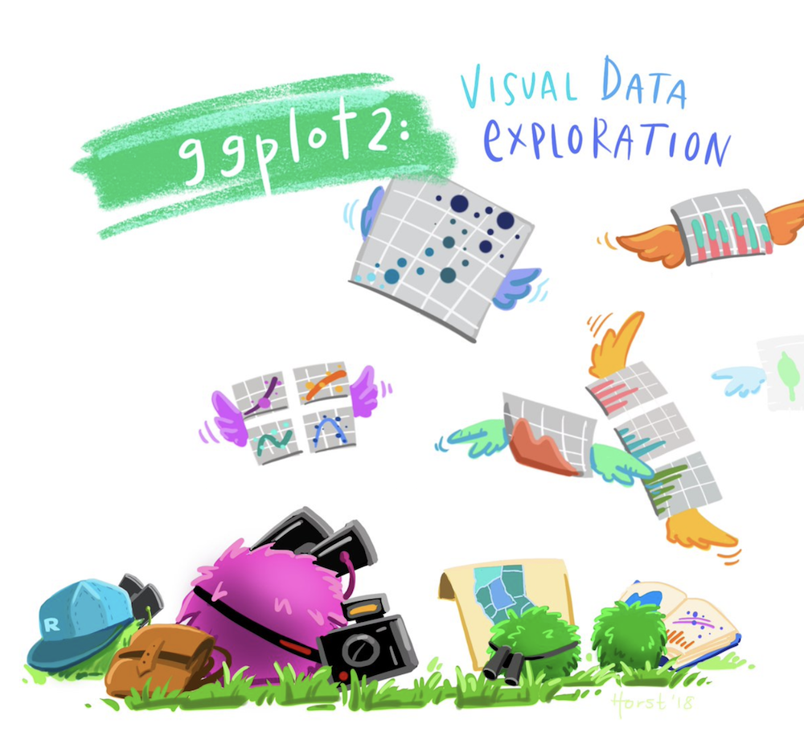

```{r setup, include=FALSE, message = FALSE}
options(htmltools.dir.version = FALSE)
library(here)
library(tidyverse)
frames <- read_csv(here("data","frames_ex2.csv"))
beaches <- read_csv(here("data","sydneybeaches2.csv"))
```

class: split-two bg-main1

.column.bg-main1[.content.vmiddle.center[

# Data visualisation

<br>

.pull.left[.pad1[

### .orange[**What?**] Drawing pictures
### .orange[**Why?**] Understand your data
### .orange[**How?**] Using tidyverse (ggplot2)

]]

]]

.column.bg-main3[.content.vmiddle.center[



[@allison_horst](https://twitter.com/allison_horst)

]]


<!-- *********** NEW SLIDE ************** -->
---

class: bg-main1 center middle hide-slide-number

.reveal-text.bg-main2[.pad1[
.font4[The Sydney Beaches Data]
]]


<!-- *********** NEW SLIDE ************** -->
---

class: bg-main1 middle center

.pull.left[.pad1[.font2[
```{r beachesdata, eval=TRUE, message=FALSE}
beaches <- here("data","sydneybeaches2.csv") %>% read_csv() 
beaches
```
]]]


<!-- *********** NEW SLIDE ************** -->
---

class: bg-main1 center middle hide-slide-number

.reveal-text.bg-main2[.pad1[
.font4[Painting a Picture]
]]


<!-- *********** NEW SLIDE ************** -->
---
class: split-50 bg-main1

.column.bg-main1[.content.vtop.center[

.pull.left[.pad1[.font2[

## A grammar...

- grammars compose & reuse small parts
- complex structures from simpler units

## ...of graphics

- uses the "painters model"
- a plot is built in layers
- each layer is drawn on top of the last

]]]
]]

.column.bg-main3[.content.vmiddle.center[


[Image credit: Trinity Treft](https://unsplash.com/photos/waYWz3vAYJQ)

]]


<!-- *********** NEW SLIDE ************** -->
---
class: split-40 bg-main1

.column.bg-main1[.content.vtop.center[

.pull.left[.pad1[.font2[

A blank canvas

```{r, eval=FALSE, message = FALSE}
ggplot()
```

]]]
]]

.column.bg-main3[.content.vtop.center[
.pad1[.font2[
```{r blankcanvas, eval=TRUE, message = FALSE, echo=FALSE, cache=TRUE}
ggplot() 
```

]]
]]


<!-- *********** NEW SLIDE ************** -->
---
class: split-40 bg-main1

.column.bg-main1[.content.vtop.center[
.pull.left[.pad1[.font2[
Specify the data
```{r, eval=FALSE, message = FALSE}
ggplot(
  data = beaches #<<
)
```

]]]
]]

.column.bg-main3[.content.vtop.center[
.pad1[.font2[
```{r stillblankcanvas, eval=TRUE, message = FALSE, echo=FALSE, cache=TRUE}
ggplot(
  data = beaches #<<
) 
```

]]
]]


<!-- *********** NEW SLIDE ************** -->
---
class: split-40 bg-main1

.column.bg-main1[.content.vtop.center[

.pull.left[.pad1[.font2[
Specify the aesthetics
```{r, eval=FALSE, message = FALSE}
ggplot(
  data = beaches,
  mapping = aes(      #<<
    x = temp_airport, #<<
    y = rain_mm       #<<
  )                   #<<
)
```

- x-axis location
- y-axis location
- colour of marker
- fill of a marker
- shape of a marker
]]]
]]

.column.bg-main3[.content.vtop.center[
.pad1[.font2[
```{r aesthetics, eval=TRUE, message = FALSE, echo=FALSE, cache=TRUE}
ggplot(
  data = beaches,
  mapping = aes(
    x = temp_airport, 
    y = rain_mm
  ) 
)
```

]]
]]


<!-- *********** NEW SLIDE ************** -->
---
class: split-40 bg-main1

.column.bg-main1[.content.vtop.center[

.pull.left[.pad1[.font2[
Add a layer
```{r, eval=FALSE, message = FALSE}
ggplot(
  data = beaches,
  mapping = aes(
    x = temp_airport, 
    y = rain_mm
  ) 
) + 
geom_point() #<<
```

]]]
]]

.column.bg-main3[.content.vtop.center[
.pad1[.font2[
```{r add_layer, eval=TRUE, message = FALSE, echo=FALSE, cache=TRUE, warning=FALSE}
ggplot(
  data = beaches,
  mapping = aes(
    x = temp_airport, 
    y = rain_mm
  ) 
) + 
geom_point() #<<
```

]]
]]


<!-- *********** NEW SLIDE ************** -->
---
class: split-40 bg-main1

.column.bg-main1[.content.vtop.center[

.pull.left[.pad1[.font2[
Add more layers
```{r, eval=FALSE, message = FALSE}
ggplot(
  data = beaches,
  mapping = aes(
    x = temp_airport, 
    y = rain_mm
  ) 
) + 
geom_point() + 
geom_rug() #<<
```

]]]
]]

.column.bg-main3[.content.vtop.center[
.pad1[.font2[
```{r two_layers, eval=TRUE, message = FALSE, echo=FALSE, cache=TRUE, warning=FALSE}
ggplot(
  data = beaches,
  mapping = aes(
    x = temp_airport, 
    y = rain_mm
  ) 
) + 
geom_point() + 
geom_rug() #<<
```

]]
]]


<!-- *********** NEW SLIDE ************** -->
---
class: split-40 bg-main1

.column.bg-main1[.content.vtop.center[

.pull.left[.pad1[.font2[
Aesthetics are inherited
```{r, eval=FALSE, message = FALSE}
ggplot(
  data = beaches,
  mapping = aes(
    x = temp_airport, 
    y = rain_mm,
    colour = year #<<
  ) 
) + 
geom_point() + 
geom_rug() 
```

]]]
]]

.column.bg-main3[.content.vtop.center[
.pad1[.font2[
```{r add_colour, eval=TRUE, message = FALSE, echo=FALSE, cache=TRUE, warning=FALSE}
ggplot(
  data = beaches,
  mapping = aes(
    x = temp_airport, 
    y = rain_mm,
    colour = year #<<
  ) 
) + 
geom_point() + 
geom_rug() 
```

]]
]]


<!-- *********** NEW SLIDE ************** -->
---
class: split-40 bg-main1

.column.bg-main1[.content.vtop.center[

.pull.left[.pad1[.font2[
Separate into facets
```{r, eval=FALSE, message = FALSE}
ggplot(
  data = beaches,
  mapping = aes(
    x = temp_airport, 
    y = rain_mm,
    colour = year
  ) 
) + 
geom_point() + 
geom_rug() + 
facet_wrap(vars(season)) #<<
```

]]]
]]

.column.bg-main3[.content.vtop.center[
.pad1[.font2[
```{r add_facets, eval=TRUE, message = FALSE, echo=FALSE, cache=TRUE, warning=FALSE}
ggplot(
  data = beaches,
  mapping = aes(
    x = temp_airport, 
    y = rain_mm,
    colour = year #<<
  ) 
) + 
geom_point() + 
geom_rug() + 
facet_wrap(vars(season)) #<<
```

]]
]]


<!-- *********** NEW SLIDE ************** -->
---
class: split-40 bg-main1

.column.bg-main1[.content.vtop.center[

.pull.left[.pad1[.font2[
Layers can compute things!
```{r, eval=FALSE, message = FALSE}
ggplot(
  data = beaches,
  mapping = aes(x = temp_airport) 
) + 
geom_histogram() + #<<
facet_wrap(vars(season))
```

- histograms are not "in the data"

]]]
]]
--

.column.bg-main3[.content.vtop.center[
.pad1[.font2[
```{r add_histogram, eval=TRUE, message = FALSE, echo=FALSE, cache=TRUE, warning=FALSE}
ggplot(
  data = beaches,
  mapping = aes(x = temp_airport) 
) + 
geom_histogram() + 
facet_wrap(vars(season))
```

]]
]]


<!-- *********** NEW SLIDE ************** -->
---
class: split-40 bg-main1

.column.bg-main1[.content.vtop.center[

.pull.left[.pad1[.font2[
Layers can compute things!
```{r, eval=FALSE, message = FALSE}
ggplot(
  data = beaches,
  mapping = aes(x = temp_airport) 
) + 
geom_density() + #<<
facet_wrap(vars(season))
```

- histograms are not "in the data"
- kernel density estimates are not "in the data"


]]]
]]


.column.bg-main3[.content.vtop.center[
.pad1[.font2[
```{r add_density, eval=TRUE, message = FALSE, echo=FALSE, cache=TRUE, warning=FALSE}
ggplot(
  data = beaches,
  mapping = aes(x = temp_airport) 
) +  
geom_density() + 
facet_wrap(vars(season))
```

]]
]]


<!-- *********** NEW SLIDE ************** -->
---
class: split-40 bg-main1

.column.bg-main1[.content.vtop.center[

.pull.left[.pad1[.font2[
Themes allow customisation
```{r, eval=FALSE, message = FALSE}
ggplot(
  data = beaches,
  mapping = aes(x = temp_airport) 
) + 
geom_density() + 
facet_wrap(vars(season)) + 
theme_bw() #<<
```


]]]
]]


.column.bg-main3[.content.vtop.center[
.pad1[.font2[
```{r add_theme, eval=TRUE, message = FALSE, echo=FALSE, cache=TRUE, warning=FALSE}
ggplot(
  data = beaches,
  mapping = aes(x = temp_airport) 
) +  
geom_density() + 
facet_wrap(vars(season)) + 
theme_bw()
```

]]
]]


<!-- *********** NEW SLIDE ************** -->
---
class: split-40 bg-main1

.column.bg-main1[.content.vtop.center[

.pull.left[.pad1[.font2[
Adding titles
```{r, eval=FALSE, message = FALSE}
ggplot(
  data = beaches,
  mapping = aes(x = temp_airport) 
) + 
geom_density() + 
facet_wrap(vars(season)) + 
theme_bw() + 
ggtitle("Sydney temperature") + #<<
xlab("Temperature") + #<<
ylab("Density") #<<
```


]]]
]]


.column.bg-main3[.content.vtop.center[
.pad1[.font2[
```{r add_titles, eval=TRUE, message = FALSE, echo=FALSE, cache=TRUE, warning=FALSE}
ggplot(
  data = beaches,
  mapping = aes(x = temp_airport) 
) +  
geom_density() + 
facet_wrap(vars(season)) + 
theme_bw() +
ggtitle("Sydney temperature") + #<<
xlab("Temperature") + #<<
ylab("Density") #<<
```

]]
]]


<!-- *********** NEW SLIDE ************** -->
---

class: center middle hide-slide-number

.pad1[
.font4[
Exercise 1: Testing the flexibility of ggplot2 <br>
https://djnavarro.github.io/some_url_here
]]


<!-- *********** NEW SLIDE ************** -->
---

class: bg-main1 middle center

.pull.left[.pad1[.font2[
- List of 
- Useful resources
- Goes here
]]]

<!-- DONE -->
---

class: bg-main1 middle center

## thank u, next


